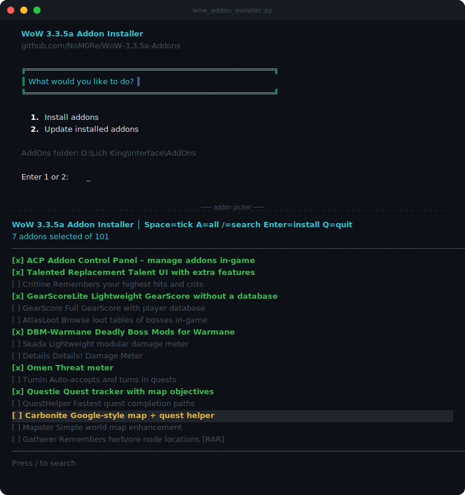

# WoW 3.3.5a Addon Installer

A command-line tool for installing and updating World of Warcraft addons. By default it pulls from [NoM0Re's WoW-3.3.5a-Addons](https://github.com/NoM0Re/WoW-3.3.5a-Addons) repository, but you can point it at any other addon repo by pasting a different download URL when prompted. Features a full-screen interactive picker, smart extraction, automatic update checking via the GitHub API, and a Lich King terminal banner because why not.

[](https://buymeacoffee.com/jamesisonfire)

---

## Screenshots



---

## Features

- **Native folder picker** — on first launch a folder browser dialog opens so you can select your AddOns directory without typing a path; the choice is saved for future runs
- **Interactive curses UI** — navigate with arrow keys, tick addons with Space, search with `/`
- **Install addons** — browse and select from 100+ catalogued addons, with the option to use a different repo URL at install time
- **Custom repos** — not limited to NoM0Re's repo; paste any direct GitHub download link when prompted and the tool will download, extract, and name it correctly
- **Update checking** — compares local install dates against the latest GitHub commit date and shows what's out of date
- **Smart extraction** — handles every GitHub zip layout: single folder, multi-folder (e.g. Bagnon), double-nested wrappers, loose files
- **Clean naming** — strips `-main` / `-master` / `-335` suffixes so folders always get the proper name
- **Fix existing names** — `--fix-names` scans your AddOns folder and renames any badly-named leftovers
- **Stays open** — after installing or updating, returns to the main menu rather than closing

---

## Requirements

- Python 3.8+
- Windows, macOS, or Linux

### Installing Python

**Windows:**
1. Go to [python.org/downloads](https://www.python.org/downloads/) and download the latest Python 3 installer
2. Run the installer — **make sure to tick "Add Python to PATH"** before clicking Install
3. Open a Command Prompt and run `python --version` to confirm it worked

**macOS:**
1. Go to [python.org/downloads](https://www.python.org/downloads/) and download the latest Python 3 installer, or install via Homebrew: `brew install python`
2. Run `python3 --version` in Terminal to confirm

**Linux:**
```
sudo apt install python3 python3-pip   # Debian/Ubuntu
sudo dnf install python3               # Fedora
```

### Windows — install curses support

After installing Python, open a Command Prompt and run:

```
pip install windows-curses
```

### Optional — RAR support (only needed for the Gatherer addon)

```
pip install rarfile
# Windows: install WinRAR or 7-Zip and ensure unrar.exe is on PATH
# Linux:   sudo apt install unrar
```

---

## Installation

Download `wow_addon_installer.py` and run it directly — no other files needed.

```
python wow_addon_installer.py
```

**First run:** a native folder picker dialog opens automatically so you can browse to your `Interface\AddOns` folder. The path is saved to `~/.wow_addon_installer` and reused on every subsequent launch — no prompt needed.

If you'd rather set a hardcoded default, edit this line near the top of the file:

```python
DEFAULT_ADDON_DIR = r"D:\Lich King\Interface\AddOns"
```

---

## Usage

### Interactive mode (recommended)

```
python wow_addon_installer.py
```

On launch you'll see the main menu:

```
  1.  Install addons
  2.  Update installed addons
  3.  Change AddOns folder
```

**Option 1 — Install:**
- Optionally switch to a different repo — just paste any direct GitHub download URL (e.g. `https://github.com/someone/MyAddon/archive/refs/heads/main.zip`)
- Opens the full-screen picker to select addons from the default catalogue
- Confirms your selection before downloading
- Shows a summary when done

**Option 2 — Update:**
- Scans your AddOns folder for installed catalogue addons
- Fetches the latest commit date from GitHub for each one
- Shows what has updates available vs what's already current
- Lets you update all, pick specific ones via the curses picker, or cancel

**Option 3 — Change AddOns folder:**
- Opens the folder picker dialog again to select a different directory
- Saves the new path for future runs

### Command-line flags

```
# Install specific addons without the menu
python wow_addon_installer.py --addons DBM Questie WeakAuras

# Install everything in the catalogue
python wow_addon_installer.py --addons all

# Use a specific AddOns folder
python wow_addon_installer.py --dir "D:/Lich King/Interface/AddOns" --addons Skada

# Print the full addon list and exit
python wow_addon_installer.py --list

# Rename GitHub-style folders to clean catalogue names
python wow_addon_installer.py --fix-names

# Fix names in a specific folder
python wow_addon_installer.py --dir "D:/Lich King/Interface/AddOns" --fix-names
```

---

## Picker controls

| Key | Action |
|-----|--------|
| `↑` / `↓` | Move up / down |
| `Page Up` / `Page Down` | Jump a whole page |
| `Space` | Tick / untick the highlighted addon |
| `A` | Select all / deselect all |
| `/` | Search by name or description |
| `Esc` | Clear search |
| `Enter` | Confirm and proceed |
| `Q` | Quit without selecting |

---

## Addon catalogue

Over 100 addons are included across all categories:

| Category | Examples |
|----------|---------|
| **Raid & Combat** | DBM-Warmane, WeakAuras, Skada, Details!, Omen, GTFO, PhoenixStyle |
| **Questing** | Questie, QuestHelper, Carbonite, ZygorGuides, TurnIn |
| **UI** | ElvUI, Bartender4, Dominos, MoveAnything, BlizzMove, Shadowed Unit Frames |
| **Maps** | Mapster, Cartographer, Cromulent, Gatherer, pMinimap, SexyMap |
| **Auction House** | Auctionator, TradeSkillMaster, DalaranAH |
| **Bags** | Bagnon, AdiBags |
| **Healing** | VuhDo, HealBot, Grid2, Decursive, Clique |
| **PvP** | GladiusEx, Afflicted, InterruptBar, LoseControl, SoundAlerter |
| **Cooldowns** | OmniCC, NeedToKnow, TellMeWhen, WeakAuras, BLT |
| **Chat** | Chatter, WIM, BNetToast, ChatFilter, STFU |
| **Misc** | GearScore, AtlasLoot, RatingBuster, OPie, Postal, AutoRepair |

Run `python wow_addon_installer.py --list` to see the full catalogue with descriptions.

---

## How extraction works

The tool handles every zip layout it encounters from GitHub:

| Layout | Result |
|--------|--------|
| Plain zip with one folder (`ACP/ACP.toc`) | `AddOns\ACP\` |
| GitHub wrapper, single inner folder (`WotLK-Auctionator-main/Auctionator/`) | `AddOns\Auctionator\` |
| GitHub wrapper, multiple sub-addons (`Bagnon-3.3.5-main/.../Bagnon/, BagnonConfig/`) | `AddOns\Bagnon\`, `AddOns\BagnonConfig\`, etc. |
| Loose files at root | `AddOns\AddonName\` |

Folder names are always cleaned — suffixes like `-main`, `-master`, and `-335` are stripped automatically.

---

## Credits

Addon repository maintained by [NoM0Re](https://github.com/NoM0Re/WoW-3.3.5a-Addons).

---

## Support

If this tool saves you some time, a coffee is always appreciated!

[](https://buymeacoffee.com/jamesisonfire)
